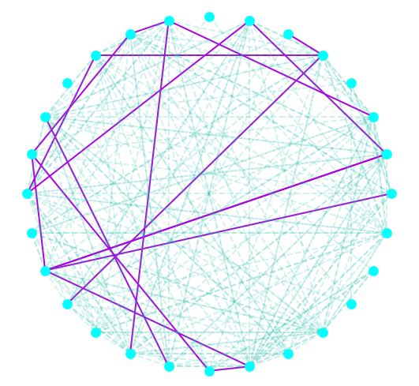

# Targeting Power-Middle Influencers
## with graph analysis and sentiment analysis

Check out the source code for this project [here](https://github.com/sdmirch/instagram-influencer-graph).

# Top Influencers
- Influence Score
- Interaction Score

- Authenticity Score

```
text = """I finally SENT my project today wooohoooo! 🎊The technical crux of the 2nd pitch of "The Kill Artist" was an airy 5.13a invert move out the roof of an enormous chimney. But the mental crux was the real hurdle for me."""
analyzer = SentimentIntensityAnalyzer()
vs = analyzer.polarity_scores(text)
print("{:-<65} {}".format(text, str(vs)))

```
