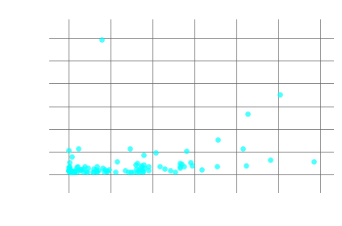

# Targeting Power-Middle Influencers


## with graph analysis and sentiment analysis

Check out the source code for this project [here](https://github.com/sdmirch/instagram-influencer-graph).

**This project page is currently under construction.**

### tl;dr
Power-Middle influencers on Instagram are a more effective and authentic option for marketing niche products to targeted communities. I created a methodology to select, construct, and analyze community networks within Instagram. Elite Power-Middle influencers were identified using social centrality measures and sentiment analysis of captions. Technologies used include Python, NetworkX, MongoDB, Selenium, and vaderSentiment.




## Top Influencers
-  Critical Mass Filter: Must have more than 5000 followers.

- Influence Score: Eigenvector centrality.



- Interaction Score: Ratio of likes to followers.


- Authenticity Score: Inversely proportional to positive sentiment in captions.

```
text = """I finally SENT my project today wooohoooo! 🎊The technical crux of the 2nd pitch of "The Kill Artist" was an airy 5.13a invert move out the roof of an enormous chimney. But the mental crux was the real hurdle for me."""
analyzer = SentimentIntensityAnalyzer()
vs = analyzer.polarity_scores(text)
print("{:-<65} {}".format(text, str(vs)))
```
